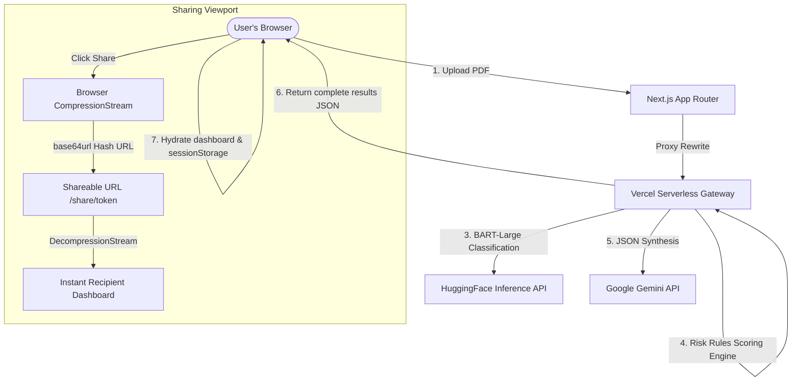

<p align="center">
  
</p>

<h1 align="center">LexAI — Legal Document Intelligence</h1>

<p align="center">
  <strong>An instant, database-less legal contract analyzer and negotiation playbook system.</strong>
</p>

<p align="center">
  
  
  
  
  
</p>

---

## 🏛️ System Philosophy: 100% Database-less & State-free

Traditional document intelligence systems rely heavily on expensive databases, object storage, and memory caches to store parsed contract segments and analysis statuses. This introduces latency, database pricing bottlenecks, and security compliance risks (storing sensitive contract documents on external servers).

**LexAI operates on a clean, in-flight, database-less execution model:**
1. **Zero Server Retention:** The backend never stores uploaded files or analysis outputs. PDF contracts are parsed, analyzed, and synthesized in a single, synchronous, serverless request.
2. **Client-Owned Memory:** The completed report JSON is stored exclusively in the browser's `sessionStorage` or client-side application state.
3. **Stateless URL Sharing:** Public analysis sharing is achieved via **client-side GZIP compression**. When a user clicks "Share", the entire analysis JSON is compressed in the browser using the native `CompressionStream` API, encoded into a compact `base64url` token, and appended as a URL hash. When opened, the recipient's browser decompresses it in-memory via `DecompressionStream`. This guarantees lifetime link sharing with zero database costs.

---

## 🏗️ Technical Architecture & Data Flow



### The In-flight Pipeline
1. **Ingestion & Extraction (`api/parse_document.py`):** Uses **PyMuPDF** to extract raw text and structural components (headers, page indices) directly from the uploaded binary stream in memory.
2. **Document Classification (`api/lib/doc_classifier.py`):** Passes the initial contract pages to a HuggingFace-hosted **BART-Large-MNLI** zero-shot model to classify the document type (e.g., `rental_agreement`, `employment_contract`, `nda`).
3. **Clause Extraction & Segmentation (`api/lib/clause_splitter.py`):** Employs precise regular expression patterns to split the raw text into distinct, logical clauses.
4. **Risk Scoring Engine (`api/lib/risk_scorer.py`):** Evaluates every clause against custom legal heuristics (notice requirements, liability waivers, unilateral amendments) to assign a risk rating (Critical, High, Medium, Low) and calculate a weighted risk score.
5. **Generative AI Synthesis (`api/lib/llm_synthesis.py`):** The top 10 riskiest clauses are submitted to the **Google Gemini API** (`gemini-1.5-flash`) using structured JSON outputs to generate plain-English explanations, counter-clause pushbacks, and a customized negotiation guide in one final execution.

---

## ⚡ Key Features

* **Interactive Risk Dashboard:** High-fidelity custom gauge charts, document visualizers, and categorized tabs detailing risk flags and missing critical clauses.
* **In-Flight Document RAG (`api/chat.py`):** Ask questions about the contract. The client transmits the question, chat history, and the full parsed clause list back to the server. The server performs a lightweight in-memory vector match to inject context directly into Gemini's prompt.
* **Side-by-Side Draft Comparison (`api/compare.py`):** Upload a revised contract to compare modifications side-by-side. The model highlights additions, removals, and evaluates if each change is better, worse, or neutral for your signing position.
* **Vernacular Legal Translator (`api/translate.py`):** Seamless legal translation into major Indian languages (Hindi, Tamil, Telugu) with high-fidelity contextual accuracy.
* **Stateless PDF Exporter (`app/api/negotiation-pdf`):** Generates a print-ready, professional PDF negotiation guide directly from client-supplied state.

---

## 🛡️ Security Architecture & Deployment

LexAI is built with a defense-in-depth approach, combining robust client-side enforcement with native Edge protections. 

* **Zero Data Retention:** By design, the backend lacks a database. PDF parsing, LLM context generation, and inference are transient.
* **Client-Side State:** Analysis JSONs are kept exclusively in the browser's `sessionStorage`. 
* **Vercel Edge Firewall:** Automatically protects against basic DDoS vectors, blocks known malicious IP signatures, and handles volumetric threats at the Edge (Included natively with Vercel deployment).
* **Strict Security Headers (CSP & HSTS):** The application is configured with `next.config.js` headers enforcing strict Content Security Policies (CSP), HTTP Strict Transport Security (HSTS) with a 2-year max-age, and anti-clickjacking (`X-Frame-Options: DENY`) to ensure payload execution safety.
* **Environment Isolation:** Keys (like `GEMINI_API_KEY`) are kept isolated on the serverless edge and never leaked to the client boundary.

---

## 🛠️ Technology Stack

### Frontend Client
* **Framework:** Next.js 14 (App Router, Server Components)
* **Language:** TypeScript 5
* **Styling:** Vanilla CSS + TailwindCSS 3.4 (premium glassmorphic dark-theme)
* **Animations:** Motion 12 (Framer Motion)
* **Visualizations:** Recharts 3 (Gauge and distribution charts)
* **Document Rendering:** react-pdf 10 (Dynamic SSR-free PDF.js integration)

### Backend API
* **Runtime:** Python 3.12 (Vercel Serverless Functions)
* **PDF Engine:** PyMuPDF (fitz)
* **AI Core:** Google Gemini SDK (`google-generativeai`)
* **NLP Models:** HuggingFace Inference API (BART-Large-MNLI)

---

## 📁 Directory Structure

```
LexAI/
├── api/                    # Python Serverless API Stack
│   ├── parse_document.py   # Synchronous PDF ingestion pipeline
│   ├── chat.py             # Client-passed RAG chatbot Q&A
│   ├── compare.py          # Side-by-side draft comparison
│   ├── translate.py        # Indian language translator (HI, TA, TE)
│   └── lib/                # Core analytical modules
│       ├── doc_classifier.py     # BART-MNLI document type predictor
│       ├── clause_splitter.py    # Regex structural tokenizer
│       ├── risk_scorer.py        # Legal-BERT & rules heuristic grader
│       ├── missing_clauses.py    # Required standard clause scanner
│       ├── llm_synthesis.py      # Gemini API synthesis controller
│       └── standard_clauses.json # Golden-standard legal metrics reference
├── src/                    # Next.js App Router Client
│   ├── app/                # Page route layouts
│   ├── components/         # High-fidelity dashboard widgets
│   ├── hooks/              # Session storage and API integration wrappers
│   ├── lib/                # API client models and TypeScript definitions
│   └── styles/             # Global variables and typography
├── requirements.txt        # Lightweight backend dependencies
├── vercel.json             # Serverless routing and compilation settings
└── package.json            # Node.js dependencies
```

---

## 🚀 Getting Started

### Local Setup

1. **Clone the repository:**
   ```bash
   git clone https://github.com/lakshminarasimmann/lex-ai.git
   cd lex-ai
   ```

2. **Install Node.js dependencies:**
   ```bash
   npm install
   ```

3. **Configure Environment Variables:**
   Create a `.env.local` file in your root directory:
   ```env
   GEMINI_API_KEY=AIzaSyYourGeminiApiKey
   HUGGINGFACE_API_KEY=hf_YourHuggingFaceToken
   ```

4. **Launch the Development Server:**
   ```bash
   npm run dev
   ```
   Open your browser to [http://localhost:3000](http://localhost:3000).

---

## 🌐 Production Deployment to Vercel

Since the application is database-less, deploying online requires only linking the repository and providing the API keys.

1. **Link your project:**
   ```bash
   npx vercel link
   ```
2. **Add Environment Variables securely via CLI:**
   ```bash
   npx vercel env add GEMINI_API_KEY production
   npx vercel env add HUGGINGFACE_API_KEY production
   ```
3. **Deploy to production:**
   ```bash
   npx vercel --prod
   ```

---

## 📊 Dataset & Model Citations

* **BART-Large-MNLI**: Zero-shot text classifier hosted on HuggingFace for lightning-fast document classification.
* **CUAD (Contract Understanding Atticus Dataset)**: Annotations and mapping logic influenced by the Atticus Project NLP dataset designed for legal contract reviews.
* **Legal-BERT**: Context-specific legal vocabulary patterns adapted into our custom rules scoring engine.
