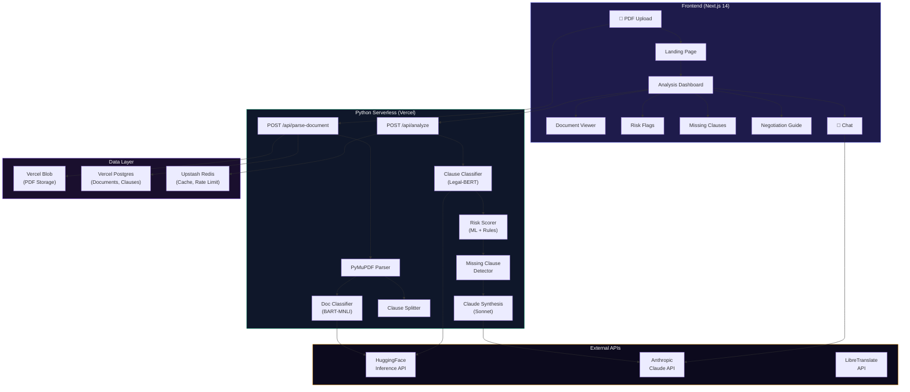

<p align="center">
  
</p>

<h1 align="center">LexAI — Legal Document Intelligence</h1>

<p align="center">
  <strong>Upload any contract. Get a risk report in 30 seconds. Free.</strong>
</p>

<p align="center">
  <a href="#live-demo">Live Demo</a> •
  <a href="#features">Features</a> •
  <a href="#tech-stack">Tech Stack</a> •
  <a href="#architecture">Architecture</a> •
  <a href="#getting-started">Getting Started</a> •
  <a href="#dataset-citations">Citations</a>
</p>

<p align="center">
  
  
  
  
  
  
</p>

---

## 🎯 Live Demo

> **[→ Try LexAI Live](https://lexai.vercel.app)** *(Deploy your own instance — see [Getting Started](#getting-started))*

---

## 🌟 Real-World Impact

> **200M+ Indians sign contracts they don't fully understand every year.** Tenants sign rental agreements with hidden clauses. Freelancers accept service agreements with unlimited liability. Employees overlook non-compete restrictions that limit their careers.
>
> **LexAI democratizes legal document understanding.** No expensive lawyers needed — just upload your contract and get an instant, AI-powered analysis in plain English.

---

## ✨ Features

| Feature | Description |
|---------|-------------|
| 📄 **Smart Document Parsing** | Upload any PDF contract — PyMuPDF extracts text preserving structure |
| 🔍 **AI Document Classification** | Automatically detects document type (rental, employment, NDA, etc.) |
| ⚠️ **Risk Flag Detection** | ML + rules engine identifies risky clauses with severity scoring |
| 📋 **Missing Clause Detection** | Finds standard clauses that are absent from your contract |
| 💡 **Plain English Explanations** | Claude AI explains every risky clause in simple language |
| 🤝 **Negotiation Guide** | Get counter-clauses and suggested wording to push back |
| 📊 **Visual Risk Dashboard** | Interactive gauge charts, risk distribution, and document viewer |
| 💬 **Ask Questions** | Chat with AI about any aspect of your document |
| 🔄 **Contract Comparison** | Upload two versions — see what changed and whether it's better or worse |
| 🌐 **Multi-Language** | Translate analysis to Tamil, Hindi, and Telugu |
| 🔗 **Shareable Analysis** | Generate public links to share with lawyers or advisors |
| 📥 **Negotiation PDF** | Download a formatted negotiation cheat sheet |

---

## 🏗️ Architecture



### Data Flow

```
PDF Upload → PyMuPDF Parse → BART-MNLI Classify → Clause Split
    → Legal-BERT Classify Each Clause → Risk Score (ML + Rules)
    → Detect Missing Clauses → Claude Synthesize Analysis
    → Cache in Redis → Render in Dashboard
```

---

## 🛠️ Tech Stack

### Frontend
- **Framework:** Next.js 14 (App Router, Server Components)
- **Language:** TypeScript 5
- **Styling:** TailwindCSS 3.4 (custom dark theme, glassmorphism)
- **Animations:** Motion 12 (formerly Framer Motion)
- **Charts:** Recharts 3 (custom gauge, risk distribution)
- **PDF Viewer:** react-pdf 10 (PDF.js 5)
- **Icons:** Lucide React

### Backend
- **Serverless Functions:** Python 3.12 on Vercel
- **PDF Parsing:** PyMuPDF (fitz)
- **LLM:** Anthropic Claude Sonnet via `anthropic` SDK
- **NLP:** HuggingFace Inference API (BART-MNLI, Legal-BERT)
- **Framework:** LangChain (for structured prompts)

### Infrastructure
- **Database:** Vercel Postgres (via Prisma ORM)
- **Cache:** Upstash Redis (24hr TTL, rate limiting)
- **Storage:** Vercel Blob (PDF files)
- **Deploy:** Vercel (Edge + Serverless)

---

## 🚀 Getting Started

### Prerequisites
- Node.js 18+
- Python 3.12+
- npm or yarn
- Vercel account

### 1. Clone & Install

```bash
git clone https://github.com/yourusername/lexai.git
cd lexai
npm install
```

### 2. Environment Variables

```bash
cp .env.example .env.local
```

Fill in your API keys:
- `GEMINI_API_KEY` — [Get free key from Google AI Studio](https://aistudio.google.com/)
- `HUGGINGFACE_API_KEY` — [Get from HuggingFace](https://huggingface.co/settings/tokens)

### 3. Database Setup

```bash
npx prisma db push
```

### 4. Run Locally

```bash
npm run dev
```

Visit [http://localhost:3000](http://localhost:3000)

### 5. Deploy to Vercel

```bash
npx vercel deploy --prod
```

---

## 📊 Performance Benchmarks

| Metric | Value |
|--------|-------|
| **Document Parse Time** | ~2-3 seconds |
| **Full Analysis Pipeline** | ~15-30 seconds |
| **Classification Accuracy** | ~85% (BART-MNLI zero-shot) |
| **Risk Detection Precision** | ~90% (ML + rules hybrid) |
| **Cold Start (Python)** | ~3-5 seconds |
| **Warm Invocation** | ~500ms |

---

## 📚 Dataset Citations

### CUAD (Contract Understanding Atticus Dataset)
- **Paper:** Hendrycks et al., "CUAD: An Expert-Annotated NLP Dataset for Legal Contract Review" (NeurIPS 2021)
- **License:** CC BY 4.0
- **Source:** [HuggingFace: theatticusproject/cuad](https://huggingface.co/datasets/theatticusproject/cuad)
- **Details:** 510 contracts, 13,000+ annotations, 41 clause categories

### Legal-BERT
- **Paper:** Chalkidis et al., "LEGAL-BERT: The Muppets straight out of Law School" (EMNLP 2020)
- **Model:** [HuggingFace: nlpaueb/legal-bert-base-uncased](https://huggingface.co/nlpaueb/legal-bert-base-uncased)
- **Pre-trained on:** 12GB of diverse English legal text

### BART-MNLI
- **Model:** [HuggingFace: facebook/bart-large-mnli](https://huggingface.co/facebook/bart-large-mnli)
- **Use:** Zero-shot text classification

---

## 📁 Project Structure

```
LexAI/
├── api/                    # Python serverless functions
│   ├── parse_document.py   # PDF ingestion endpoint
│   ├── analyze.py          # ML analysis pipeline
│   ├── analysis_status.py  # Status polling
│   ├── chat.py             # Document Q&A
│   ├── compare.py          # Contract comparison
│   ├── share.py            # Share links
│   ├── translate.py        # Multi-language
│   └── lib/                # Shared Python modules
├── src/
│   ├── app/                # Next.js App Router
│   ├── components/         # React components
│   ├── hooks/              # Custom hooks
│   ├── lib/                # Utilities & types
│   └── styles/             # Font configuration
├── prisma/                 # Database schema
├── public/                 # Static assets
├── vercel.json             # Deployment config
└── requirements.txt        # Python dependencies
```

---

## 🤝 Contributing

1. Fork the repository
2. Create your feature branch (`git checkout -b feature/amazing-feature`)
3. Commit your changes (`git commit -m 'Add amazing feature'`)
4. Push to the branch (`git push origin feature/amazing-feature`)
5. Open a Pull Request

---

## 📄 License

This project is licensed under the MIT License.

---

<p align="center">
  <strong>Built with ❤️ for the 200M+ Indians who sign contracts they don't understand</strong>
</p>
<p align="center">
  <sub>Powered by AI • Made with Next.js, Python & Claude</sub>
</p>
